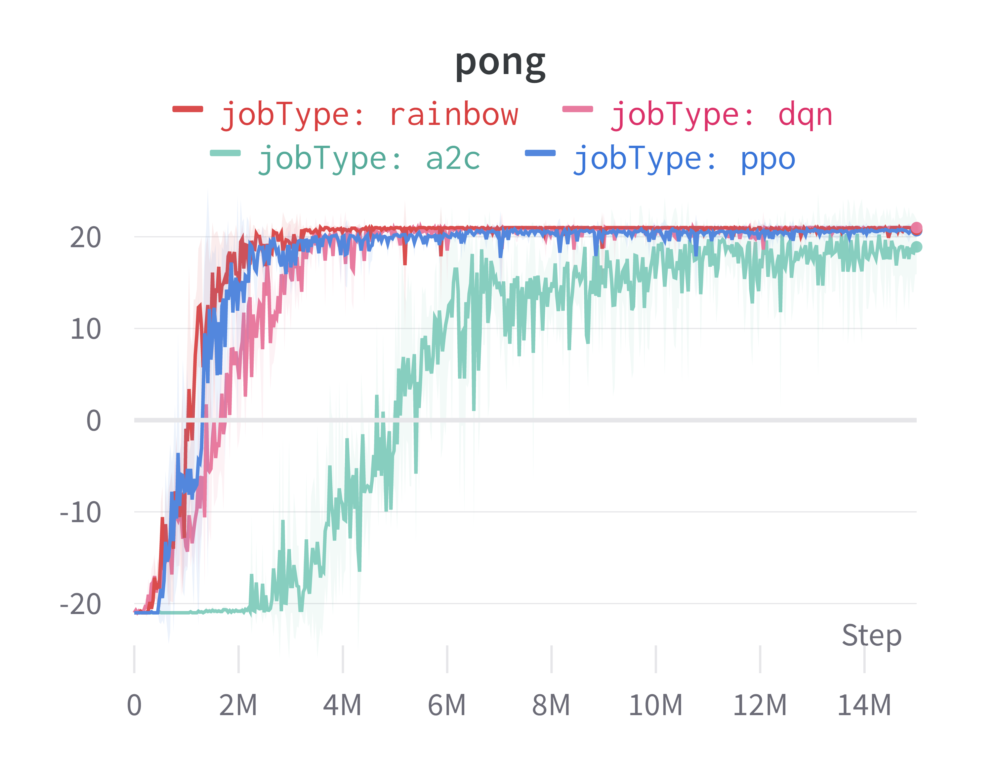
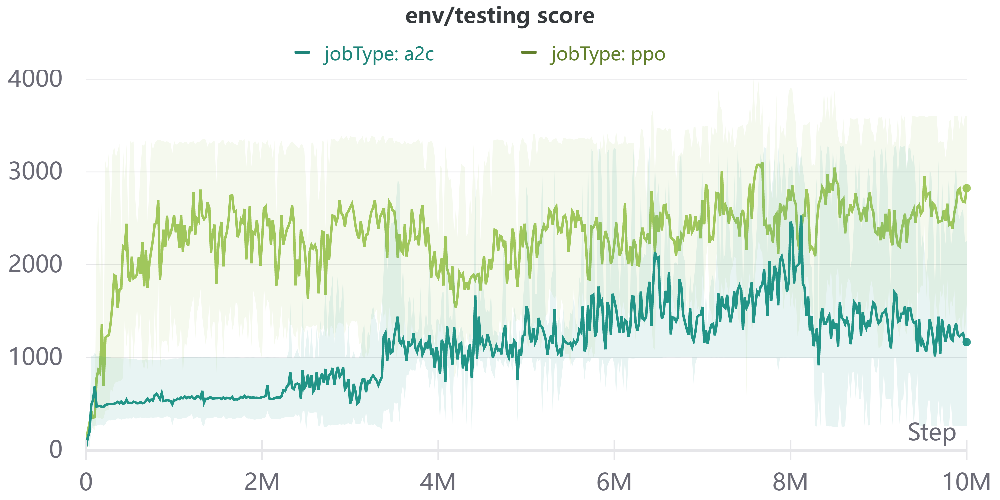

# *(To Be Continued ...)* Easy-to-read Deep Reinforcement Learning Algorithms in a Compact Implementation

| Algorithms |  |
| :--------: | :---------------: |
| dqn | :x: |
| a2c | :heavy_check_mark: |
| ddpg | :heavy_check_mark: |
| ppo | :heavy_check_mark: |
| rainbow | :x: |
| td3 | :heavy_check_mark: |
| sac | :x: |

The hyperparameters are not fine tuned, but we garuantee an acceptable performance with a safe setting of hyperparameters.


## Performance


Different algorithms have varying sample efficiency and training speed, especially between on-policy algorithms and off-policy algorithms. Therefore we adopt different training steps for them.


### Pong (Atari)





### Hopper (MuJoCo)





## The Goal of This Implementation:

- Provide easy to read/learn code, avoiding nesting over nesting
- The code compactly presents the core of those algorithms


## Run

#### Requirements


All required packages are mostly used for DRL in pytorch. One can also build up the environment by:

```
pip install -r requirements.txt
```

but the results may slightly differ from what we've shown as different versions are used during our training

> Additional packages are needed for scenarios like Atari or MuJoCo.

#### Quick Start (An Running Script Example)


- To start an example experiment, say, use PPO to train an agent in the "CartPole-v1'' environment, you can direct use:

```
cd compactDRL
bash scripts/ppo/CartPole.sh 0 1
```

where "0" is the PGU-id, and "1" is the seed of the entire experiment

See README in each drl/algo folder for some tips for a specific algorithm


## Quick Facts you should know about this implementation:


- All the core codes are presented in the drl/"algo name"/ folder, which might be friendly for the reader
- You could use commands in the scripts/ folder to start an experiment directly
- To run an experiment only two additional files are needed: an environment file (which can be regarded as a lightly extended OpenAI Gym API) and a buffer file (which is used **solely** for storage), and all other works can be done by algorithm local files
- In an experiment, "run.py" will first find suitable "env" and "buffer" for the specific configuration. Then "run.py" passes them to "algo/main.py" and "algo/main.py" will use that "env" and "buffer" and all local files to finish the experiment


## Project Feature (Pros & Cons)

#### Spotlight


- Implementation trick usage is pruned, while those tricks that significantly affect the performance are kept
- Elaborate documentation. **Every** specific configuration (hyper-parameter) has a description: the basic configuration explanation is in run.py; the environment (buffer) configuration explanation is in envs/"env name".py (buffers/base.py); the algorithm-specific hyper-parameter explanation is in drl/"algo name"/config.py
- Acceptable performance on the most common benchmark environments in research: Atari (for discrete) and MuJoCo (for continuous), as other elegant implementation are usually not tested on all of them

#### Limitation


- Some tricks are not implemented for the sake of simplicity and clarity, and thus the performance may be worse than the best implementation
- Hyperparameters are not tuned carefully, but they are set to be safe and universal for the same scenario 
- Currently it only supports environments with either simple discrete action space or one-dimensional vectorized continuous action space
- RNN-based models are not suportted for an elegant implementation (becasue of my limited coding skills)


## Structure

    ├── drl   // Different algorithms
        ├── a2c // Use a2c for illustration, others follow exactly the same structure
            ├── main.py // Basic controller
            ├── agent.py // An ppo agent including both deciding part and learning part
            ├── config.py // Complete configuration and hyperparameter
            ├── logger.py // A simple logger for w&b
            └── other a2c stuffs (usually there is a nn_blocks.py for building basic neural networks)
        ├── ppo
        └── td3
    ├── envs   // Environments
        ├── control.py
        ├── atari.py
        ├── mujoco.py
        └── base.py
    ├── buffers   // (purely for storage) Buffers 
        ├── normal_buffer.py
        ├── image_buffer.py
        ├── vector_buffer
        └── base.py 
    ├── scripts
    ├── results
    └── run.py


## Refenrences

- The best deep reinforcement learning turorial I've found: [OpenAI Spinning Up](https://spinningup.openai.com/en/latest/)
- Spinning Up's easy-to-follow code: [Spinning Up Code](https://github.com/openai/spinningup)
- The baseline of the highest quality in pytorch that I've found: [Stable-Baselines 3](https://github.com/DLR-RM/stable-baselines3)
